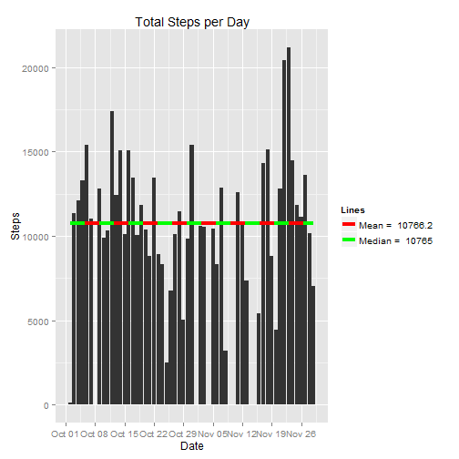
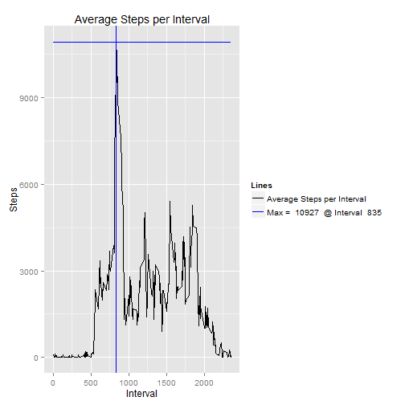
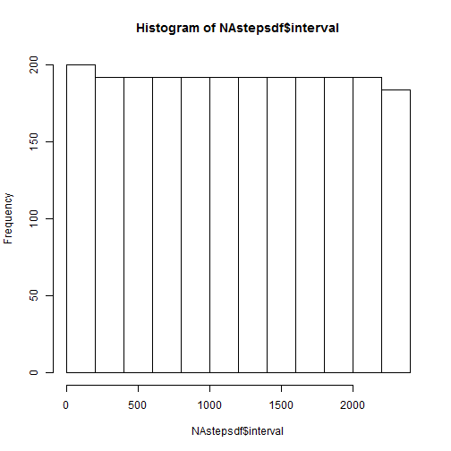
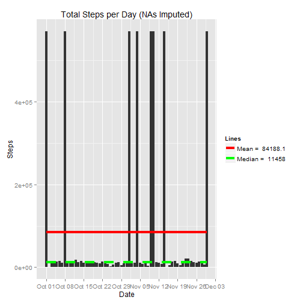
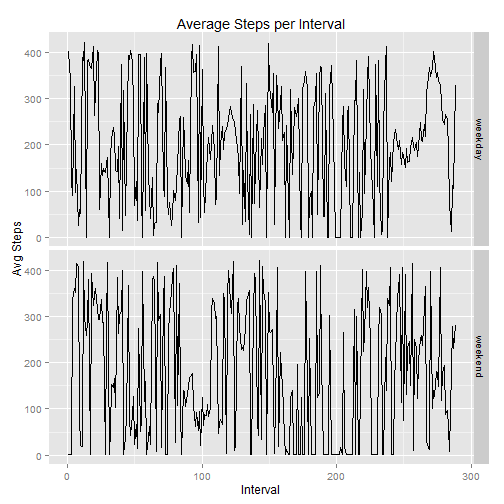

---
title: "Reproducible Research: Project 1"
author: "Emily Carr"
date: "February 7, 2016"
output: html_document
keep_md: true
***
  
  
# Loading and preprocessing the data

### Load the necessary libraries

```r
library(knitr)
library(ggplot2)
```
  
### Load the data

```r
url <- "https://d396qusza40orc.cloudfront.net/repdata%2Fdata%2Factivity.zip"
temp <- tempfile(tmpdir = getwd())
download.file(url,temp)
path <- unzip(file.path(temp),"activity.csv")
activitydata <- read.csv(path)
file.remove(path)
```

```
## [1] TRUE
```
  
### Process/transform the data (if necessary) into a format suitable for the analysis

#### Look at the data to see what kind of preprocessing is necessary

```r
summary(activitydata)
```

```
##      steps                date          interval     
##  Min.   :  0.00   2012-10-01:  288   Min.   :   0.0  
##  1st Qu.:  0.00   2012-10-02:  288   1st Qu.: 588.8  
##  Median :  0.00   2012-10-03:  288   Median :1177.5  
##  Mean   : 37.38   2012-10-04:  288   Mean   :1177.5  
##  3rd Qu.: 12.00   2012-10-05:  288   3rd Qu.:1766.2  
##  Max.   :806.00   2012-10-06:  288   Max.   :2355.0  
##  NA's   :2304     (Other)   :15840
```
*Notice the large number of NA values in the steps variable*

#### Remove NAs & Change dates variable to Date class

```r
activitydata2 <- na.omit(activitydata)
activitydata2$date <- as.Date(activitydata2$date, "%Y-%m-%d")
```

#### Create a smaller data frame of the total steps per day

```r
dates <- levels(as.factor(as.character(activitydata2$date)))
sumsteps <- numeric(length=length(dates))
for (i in 1:length(dates)) {
    x <- subset(activitydata2, activitydata2$date==dates[i])
    sumsteps[i] <- sum(x[,1])
}
stepsperday <- as.data.frame(cbind(dates, sumsteps))
```

#### Fix the classes of the two new variables

```r
stepsperday$dates <- as.Date(stepsperday$dates, "%Y-%m-%d")
stepsperday$sumsteps <- as.integer(as.character(stepsperday$sumsteps))
```
  
***
  
# What is the mean total number of steps taken per day?

### Calculate mean and median number of daily steps

```r
meansteps <- mean(stepsperday$sumsteps)
mediansteps <- median(stepsperday$sumsteps)
```
*Mean = 10766.2, Median = 10765*

### Calculate & Plot total number of steps taken per day

```r
meanline <- paste("Mean = ", round(meansteps,1))
medianline <- paste("Median = ", mediansteps)

ggplot(data=stepsperday, aes(x=dates, y=sumsteps)) +
    geom_histogram(stat="identity", position="dodge") + 
    labs(title = "Total Steps per Day", x = "Date", y = "Steps") +  
    theme(legend.position="right") + 
    scale_x_date(labels = date_format ("%b %d"), breaks = date_breaks("1 week")) + 
    geom_line(aes(y = meansteps, colour = "Mean"), size = 1.5) + 
    geom_line(aes(y = mediansteps, colour = "Median"), size = 1.5, linetype = 2) + 
    scale_colour_manual(name = "Lines", values = c("Mean" = "red", "Median" = "green"), labels = c(meanline, medianline))
```

 

***
  
# What is the average daily activity pattern?

### Make a time series plot (i.e. type = "l") of the 5-minute interval (x-axis) and the average number of steps taken, averaged across all days (y-axis)

#### Make a data frame of the 5-minute interval and the average number of steps taken, averaged across all days

```r
ints <- as.integer(as.character(levels(as.factor(as.character(activitydata2$interval)))))
avgsteps <- numeric(length=length(ints))
for (i in 1:length(ints)) {
    x <- subset(activitydata2, activitydata2$interval==ints[i])
    avgsteps[i] <- sum(x[,1])
}
intavgs <- as.data.frame(cbind(ints, avgsteps))
```

#### Make a time series plot, including a line for the max

```r
maxloc <- which.max(intavgs$avgsteps)
maxint <- intavgs$ints[maxloc]
maxstep <- intavgs$avgsteps[maxloc]

maxline <- paste("Max = ", maxstep, " @ Interval ", maxint)

ggplot(intavgs, aes(ints, avgsteps)) + 
    geom_line(aes(colour = "black")) + 
    labs(title = "Average Steps per Interval", x = "Interval", y = "Steps") + 
    theme(legend.position="right") + 
    geom_line(aes(y = maxstep, colour = "blue")) +
    geom_vline(xintercept = maxint, colour = "blue") + 
    scale_colour_manual(name="Lines", values = c("blue"="blue", "black"="black"), labels=c("Average Steps per Interval", maxline))
```

 

***
  
# Imputing missing values

### Calculate and report the total number of missing values in the dataset (i.e. the total number of rows with NAs)

```r
NAsteps <- which(is.na(activitydata$steps)) #2304
NAdate <- which(is.na(activitydata$date)) #0
NAinterval <- which(is.na(activitydata$interval)) #0
```
*Total number of rows with NAs = 2304*

### Devise a strategy for filling in all of the missing values in the dataset.

```r
#See if there is a pattern for which intervals or dates are NA
NAstepsdf <- activitydata[NAsteps,]
hist(NAstepsdf$interval) #no one interval appears to incur more NAs
```

 

```r
NAdatesummary <- summary(NAstepsdf$date)
NAdatesummary <- NAdatesummary[order(NAdatesummary, decreasing = TRUE)]
NAdatesummary #the NA values are made up of only 8 dates. Using daily avg will not work, so we will use interval average.
```

```
## 2012-10-01 2012-10-08 2012-11-01 2012-11-04 2012-11-09 2012-11-10 
##        288        288        288        288        288        288 
## 2012-11-14 2012-11-30 2012-10-02 2012-10-03 2012-10-04 2012-10-05 
##        288        288          0          0          0          0 
## 2012-10-06 2012-10-07 2012-10-09 2012-10-10 2012-10-11 2012-10-12 
##          0          0          0          0          0          0 
## 2012-10-13 2012-10-14 2012-10-15 2012-10-16 2012-10-17 2012-10-18 
##          0          0          0          0          0          0 
## 2012-10-19 2012-10-20 2012-10-21 2012-10-22 2012-10-23 2012-10-24 
##          0          0          0          0          0          0 
## 2012-10-25 2012-10-26 2012-10-27 2012-10-28 2012-10-29 2012-10-30 
##          0          0          0          0          0          0 
## 2012-10-31 2012-11-02 2012-11-03 2012-11-05 2012-11-06 2012-11-07 
##          0          0          0          0          0          0 
## 2012-11-08 2012-11-11 2012-11-12 2012-11-13 2012-11-15 2012-11-16 
##          0          0          0          0          0          0 
## 2012-11-17 2012-11-18 2012-11-19 2012-11-20 2012-11-21 2012-11-22 
##          0          0          0          0          0          0 
## 2012-11-23 2012-11-24 2012-11-25 2012-11-26 2012-11-27 2012-11-28 
##          0          0          0          0          0          0 
## 2012-11-29 
##          0
```

### Create a new dataset that is equal to the original dataset but with the missing data filled in.

```r
activitydata_filled <- activitydata
for (i in 1:length(NAsteps)) {
    int <- activitydata[NAsteps[i],3]
    stepavg <- intavgs[which(intavgs$ints==int),2]
    activitydata_filled[NAsteps[i],1] <- stepavg
}
#double check that there are no more NAs
which(is.na(activitydata_filled$steps)) #0
```

```
## integer(0)
```

### Compare removing the NAs vs imputing the missing values
Make a histogram of the total number of steps taken each day and Calculate and report the mean and median total number of steps taken per day. Do these values differ from the estimates from the first part of the assignment? What is the impact of imputing missing data on the estimates of the total daily number of steps?

#### Create a smaller data frame of the total steps per day

```r
dates_filled <- levels(as.factor(as.character(activitydata_filled$date)))
sumsteps_filled <- numeric(length=length(dates_filled))
for (i in 1:length(dates_filled)) {
    x <- subset(activitydata_filled, activitydata_filled$date==dates_filled[i])
    sumsteps_filled[i] <- sum(x[,1])
}
stepsperday_filled <- as.data.frame(cbind(dates_filled, sumsteps_filled))
```

#### Fix the classes of the two new variables

```r
stepsperday_filled$dates_filled <- as.Date(stepsperday_filled$dates_filled, "%Y-%m-%d")
stepsperday_filled$sumsteps_filled <- as.integer(as.character(stepsperday_filled$sumsteps_filled))
```

#### Calculate mean and median number of daily steps

```r
meansteps_filled <- mean(stepsperday_filled$sumsteps_filled)
mediansteps_filled <- median(stepsperday_filled$sumsteps_filled)
```

#### Plot total number of steps taken per day

```r
meanline_filled <- paste("Mean = ", round(meansteps_filled,1))
medianline_filled <- paste("Median = ", mediansteps_filled)

ggplot(data=stepsperday_filled, aes(x=dates_filled, y=sumsteps_filled)) +
    geom_histogram(stat="identity", position="dodge") + 
    labs(title = "Total Steps per Day (NAs Imputed)", x = "Date", y = "Steps") +  
    theme(legend.position="right") + 
    scale_x_date(labels = date_format ("%b %d"), breaks = date_breaks("1 week")) + 
    geom_line(aes(y = meansteps_filled, colour = "Mean"), size = 1.5) + 
    geom_line(aes(y = mediansteps_filled, colour = "Median"), size = 1.5, linetype = 2) + 
    scale_colour_manual(name = "Lines", values = c("Mean" = "red", "Median" = "green"), labels = c(meanline_filled, medianline_filled))
```

 
  
*Mean = 84188.1, Median = 11458.*
*The Mean of the imputed data set differs greatly from the NAs-removed data set - it is highly skewed towards the imputed values.*
*The Median of the imputed data set is skewed, as well, but not to the degree of the Mean.* 
  
***
  
# Are there differences in activity patterns between weekdays and weekends?

### Create a new factor variable in the dataset with two levels - "weekday" and "weekend" indicating whether a given date is a weekday or weekend day.

```r
activitydata3 <- activitydata2
daytypev <- character(length = nrow(activitydata3))
activitydata3$daytype <- daytypev
for (i in 1:nrow(activitydata3)) {
    wkday <- weekdays(activitydata3$date[i])
    if (wkday == "Saturday"|wkday == "Sunday") {
        activitydata3$daytype[i] <- "weekend"
    } else {
        activitydata3$daytype[i] <- "weekday"
    }
}
activitydata3$daytype <- as.factor(as.character(activitydata3$daytype))
```

### Make a panel plot containing a time series plot (i.e. type = "l") of the 5-minute interval (x-axis) and the average number of steps taken, averaged across all weekday days or weekend days (y-axis).

#### Make a data frame of the 5-minute interval and the average number of steps taken, averaged across all days

```r
ints3 <- as.integer(as.character(levels(as.factor(as.character(activitydata3$interval)))))
avgsteps3 <- numeric(length=(2*length(ints3)))
daytype3 <- character(length=(2*length(ints3)))
wkdayloc <- which(activitydata3$daytype=="weekday")
wkdaysub <- activitydata3[wkdayloc,]
wkendloc <- which(activitydata3$daytype=="weekend")
wkendsub <- activitydata3[wkendloc,]
for (i in 1:length(ints3)) {
    x <- subset(wkdaysub, wkdaysub$interval==ints3[i])
    avgsteps3[i] <- sum(x[,1])
    daytype3[i] <- "weekday"
}
for (i in 1:length(ints3)) {
    x <- subset(wkendsub, wkendsub$interval==ints3[i])
    avgsteps3[length(ints3)+i] <- sum(x[,1])
    daytype3[length(ints3)+i] <- "weekend"
}
intavgs3 <- as.data.frame(cbind(ints3, avgsteps3, daytype3))
intavgs3$ints3 <- as.numeric(as.factor(intavgs3$ints3))
intavgs3$avgsteps3 <- as.numeric(as.factor(intavgs3$avgsteps3))
intavgs3$daytype3 <- as.factor(intavgs3$daytype3)
```

#### Make a time series plot

```r
ggplot(intavgs3, aes(ints3, avgsteps3)) + 
    geom_line() + 
    facet_grid(daytype3~.) + 
    labs(title = "Average Steps per Interval", x = "Interval", y = "Avg Steps") 
```

 
